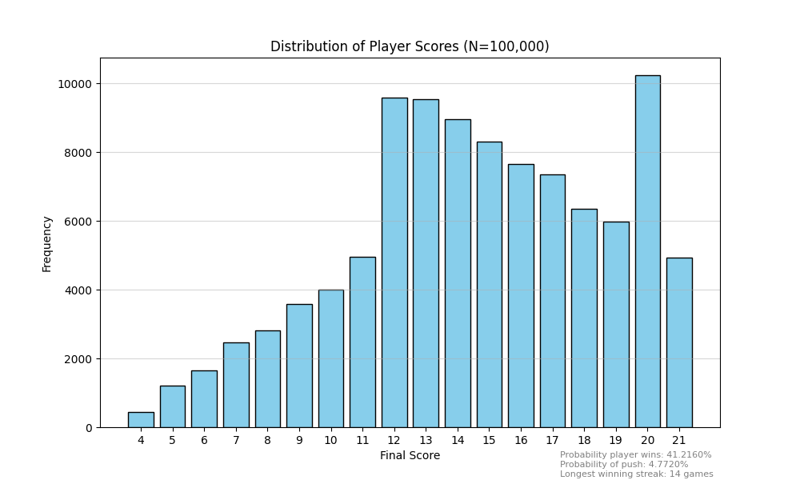

# Monte Carlo Simulation: Modeling Probabilistic Outcomes

## Project description
This project includes a script of a Monte Carlo simulation over N = 100,000 iterations of a simulated card game (Blackjack) under specific agent constraints. The goal was to generate a dataset to determine the variance in win/loss rates and the frequency distribution of final hand scores under this simple rogue strategy. 

## The strategy
We will simulate a game with one player and one dealer to investigate the probability that the player will win if they just keep their first two cards (that is, they do not ask for additional cards). While this may not be an ideal strategy, we are still curious how our player will fare against the house. 

## Technologies used
Python 3.14.2

Libraries: random, matplotlib

The script for this simulation is housed in the 'code' folder.

## Rendered output

